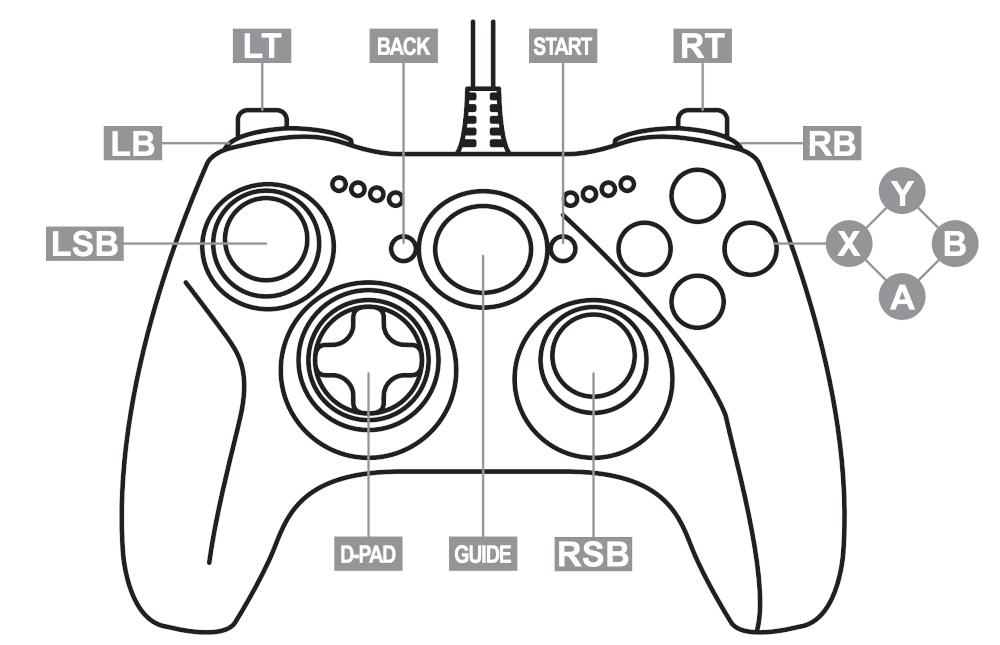

# controllable
Un programme en Python qui vise à pouvoir contrôler complètement son ordinateur à l'aide d'une mannette de jeu 

### Contrôles :

- joystick gauche (LSB) : bouger la souris
- joystick droit (RSB) : utiliser la molette de la souris
- A : cliquer avec la souris
- D-PAD : flèches directionneles du clavier

### To-do list : 
- [x] Détection de la manette
- [x] Bouger la souris à l'aide du joystick gauche
- [x] Contrôler la molette à l'aide du joystick droit
- [x] Click de la souris en appuyant sur un bouton
- [ ] Clavier virtuel
- [ ] Mettre en pause par simple pression d'un bouton

### Librairies nécessaires : 
#### inputs
Permet la détection et l'utilisation de mannettes de consoles de jeu
#### mouse
Permet de contrôler la souris
#### pyautogui
Permet de contrôler le clavier
